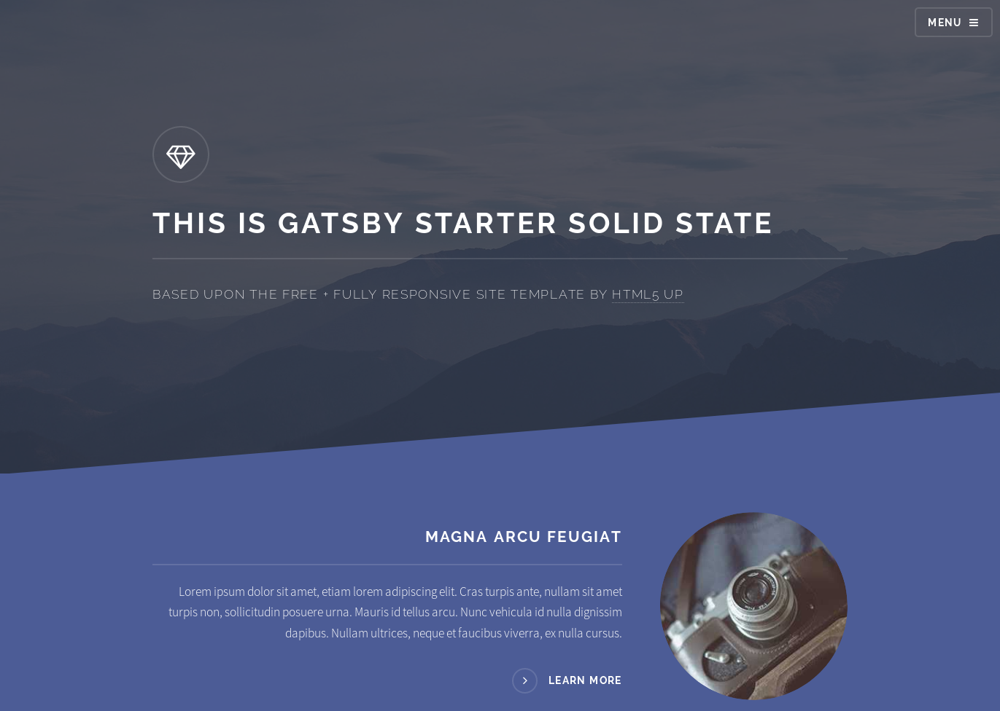
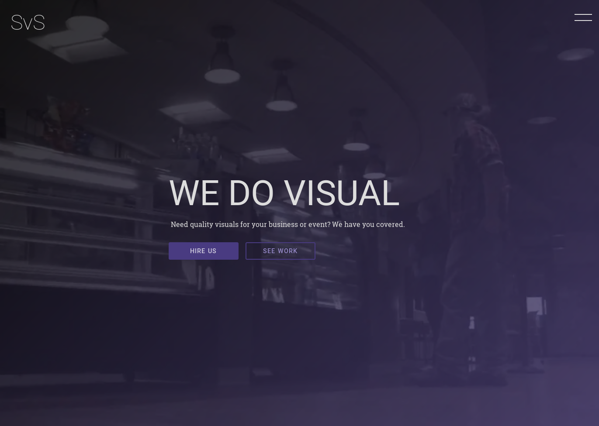
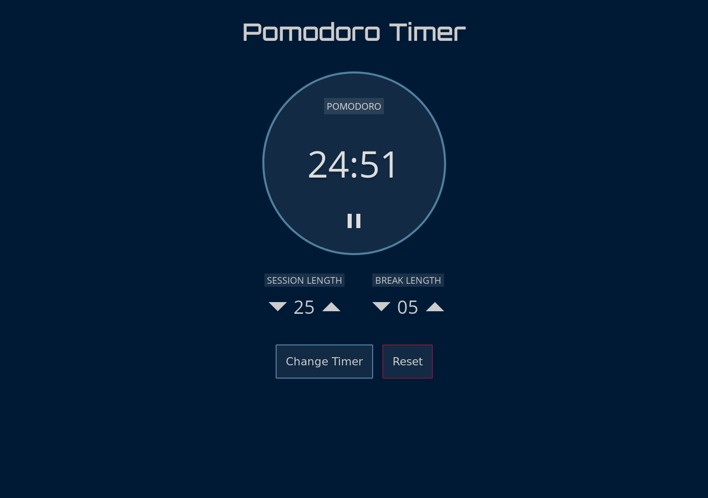
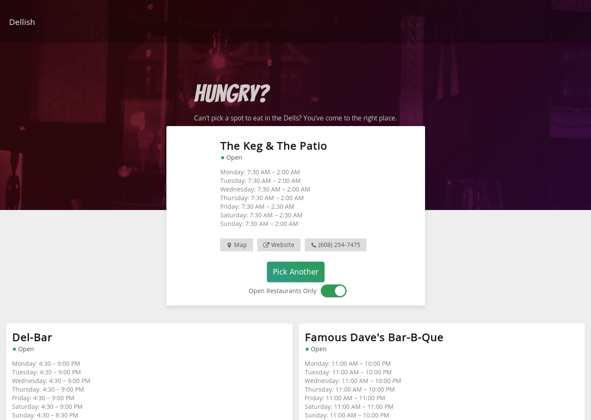

#A Selection of Projects 
_by Jacob Schmocker_  

Hello, Michelle & Heather! In preparation for our meet-and-greet, I have compiled the list of projects of which I am most proud.  
  
If you would like to see more, you are welcome to explore [my personal website](https://schmo.io) or [my GitHub repositories](https://github.com/theschmocker)!  

##Gatsby Starter Solid State 
[Live](https://gatsby-starter-solid-state.netlify.com/) | [Github](https://github.com/theschmocker/gatsby-starter-solid-state)  

This was a fun project. I converted a plain HTML template from HTML5Up into a Gatsby starter theme. Gatsby is an awesome static-site generator that uses React. I broke up the theme’s HTML elements into React components, rewrote some of the functionality originally written with jQuery, and made some modifications to the SASS codebase. One of Gatsby’s coolest features is that it allows you to pull in data at build time to incorporate into the static site that it generates. Someone could easily modify this starter theme to use as a frontend for Wordpress, Contentful, Craft CMS, etc.  

##SvS Productions 
[Live](https://upbeat-turing-ca22f9.netlify.com/) | [Github](https://github.com/theschmocker/svs-productions)  

_**DISCLAIMER**: this project is a work-in-progress_.  

This is a pro-bono site for my cousin’s video/photo business. I’m responsible for both design and development. I’m building it with Gatsby and a CSS-in-JS library called Styled Components. Styled Components is awesome, because it allows you to scope your CSS to the component it is written for; there’s no worry that your styles will leak from element to element. Perhaps the best part about this library is that it lets you use logic within your CSS, like SASS—but that logic is written with pure JavaScript. Using Gatsby gives me some flexibility in choice of CMS, down the road.  

##Pomtime  
[Live](https://pomti.me) | [Github](https://github.com/theschmocker/pomodoro)  

This is a simple pomodoro timer that I built for myself. I used plain HTML, CSS, and JavaScript. A custom Webpack configuration is used to bundle, minify, and transpile my code. The coolest part of this project is that it is a Progressive Web Application (PWA); it can be installed on a user's device and used offline!  

##Dellish
[Live](http://dellish.xyz) | [Github](https://github.com/theschmocker/dellish)  

There are way too many places to eat in Wisconsin Dells; how can anyone pick one? Dellish is a full-stack JavaScript application that aims to solve that problem by choosing for you! The Node.js backend pulls a list of Dells restaurants from the Google Places API (which only provides 60 results, unfortunately), and saves them to a database. The client-side website brings in those restaurants and offers to pick one at random. All of the restaurants are visible, but the ones that are closed can be filtered out.
